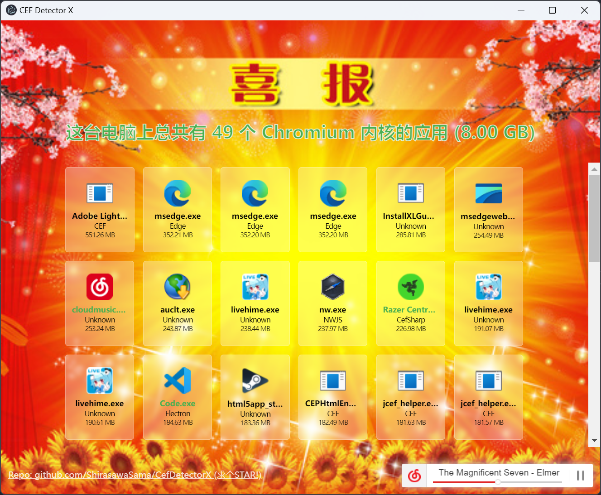

# CEF Detector X - 一眼CEF: 年轻人的第二款 Windows CEF检测器

Check how many CEFs are on your Windows.

**【2 代使用 Electron 编写并提供更多功能】**

看看你电脑 **(Windows)** 上有多少个 [CEF (Chromium Embedded Framework)](https://bitbucket.org/chromiumembedded/cef/).

> 你说的对，但是《LibCEF》是由谷歌自主研发的一款全新开放浏览器内核。第三方代码运行在在一个被称作「CEF」的浏览器沙盒，在这里，被前端程序员选中的代码将被授予「libcef.dll」，导引浏览器之力‌​​​‌‌‌‌‌‌‌‌​​‌‌​‌‌‌​‌​。你将扮演一位名为「电脑用户」的冤种角色，在各种软件的安装中下载类型各异、体积庞大的 CEF 们，被它们一起占用硬盘空间，吃光你的内存——同时，逐步发掘「CEF」的真相。

## 截屏

## 使用

**你首先需要安装 [Everything](https://www.voidtools.com/) 并完成全硬盘的扫描.**

从 [Release](https://github.com/ShirasawaSama/CefDetectorX/releases) 页面下载最新的压缩包, 解压后运行 `CefDetectorX.exe` 即可.

## 特性

- 检测 CEF 的类型: 如 [libcef](https://bitbucket.org/chromiumembedded/cef/src/master/)、[Electron](https://www.electronjs.org/)、[NWJS](https://nwjs.io/)、[CefSharp](http://cefsharp.github.io/)、[MiniBlink](https://github.com/weolar/miniblink49)、[MiniElectron](https://github.com/weolar/miniblink49)、[Edge](https://www.microsoft.com/en-us/edge) 和 [Chrome](https://www.google.com/chrome/)
- 显示总空间占用
- 显示当前所运行的进程 (绿色文件名)
- 单独显示每个程序的空间占用并按大小排序
- 支持自定义背景音乐 (默认为: [The Magnificent Seven](https://soundcloud.com/7kruzes/the-magnificent-seven), 替换 resources/app/bgm.mp3 即可)
- 可以通过添加参数 `--no-bgm` 的形式来关闭背景音乐

## 作者

Shirasawa

创意来自 @Lakr233 的 [SafariYYDS](https://github.com/Lakr233/SafariYYDS) 项目.

## 协议

[MIT](./LICENSE)
